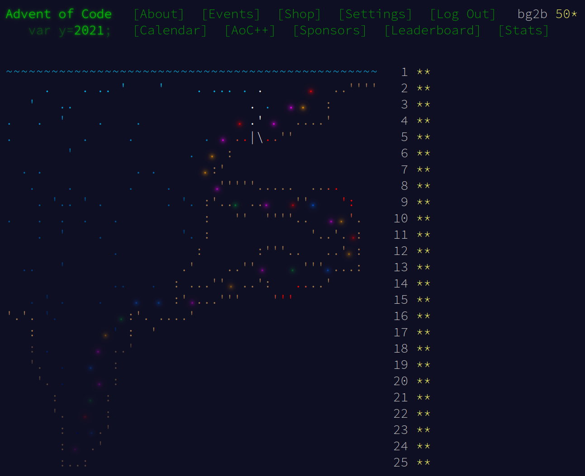

# Advent of Code 2021

Info and problems are available at https://adventofcode.com/2021

## Overview

Each day's problem input and solution is in a subdirectory, `01`, `02`, etc.

Solutions are mostly C++: problem 1 is `doit1.cc`, problem 2 is `doit2.cc`.
Compile with
```
g++ -Wall -g -o doit1 doit1.cc
```
Input is on stdin, output is printed to stdout.

Input has sometimes been pre-processed for ease of reading.
Example input if any is called `input1`.
The real input is `input` (note, my inputs are no longer included in
the repository).

Sometimes I might go back and revisit a problem in a different
(usually more efficient) way.  `doit2a.cc` would be an alternative to
`doit2.cc`.

Occasionally there's only one program used for both parts.

## Recommended problems

Here's my list of recommended problems for the year, along
with direct links.  Recommendations are based on a combination of
factors: perhaps the problem admits an unusual and clever solution, or
perhaps it would allow an interesting visualization, or perhaps the
problem description itself was cute.  In whatever way, I found the
problem unusually fun.  Each of these problems is either ⭐
(recommended) or ⭐⭐ (highly recommended).

+ [Day 13: Transparent Origami](https://adventofcode.com/2021/day/13) ⭐
+ [Day 17: Trick Shot](https://adventofcode.com/2021/day/17) ⭐
+ [Day 19: Beacon Scanner](https://adventofcode.com/2021/day/19) ⭐⭐
+ [Day 22: Reactor Reboot](https://adventofcode.com/2021/day/22) ⭐⭐
+ [Day 23: Amphipod](https://adventofcode.com/2021/day/23) ⭐
+ [Day 24: Arithmetic Logic Unit](https://adventofcode.com/2021/day/24) ⭐⭐


